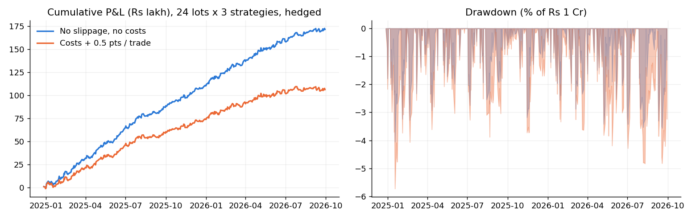

# Nifty Options Directional Strategies

Portfolio construction, hedge-fund-style risk analytics and an interactive dashboard for a book of three systematic
intraday **Nifty weekly option-selling strategies** (Strategy A, B, C) run on Rs 1 Cr, with hedge legs, slippage and
transaction costs included in the results.



## Dashboard
* Light / dark mode, institutional tear-sheet layout: KPI strip, performance and drawdown, monthly returns, P&L bridge,
  per-strategy scorecards.
* **Controls:** lots per strategy (default 24 each), capital, lot size, stand-alone or combined view, period selector,
  hedge legs on/off, slippage per trade for the short leg and for the hedge, transaction costs (brokerage, STT, exchange,
  GST, stamp duty; STT 0.10% before 1-Apr-2026 and 0.15% after), optional daily stop.
* **Risk report:** Sharpe / Sortino / Calmar, closed-day and intraday-marked drawdown, trade and day win rates, VaR / CVaR
  95/99, tail ratios, correlation and risk contribution, diversification ratio, rolling Sharpe, stress replay of the worst
  days, Monte-Carlo drawdown and return fan.
* **Benchmark:** growth of capital vs Nifty 50 buy-and-hold and cash, beta / alpha / correlation / information ratio,
  up- and down-capture, daily scatter vs Nifty moves, P&L by market regime, rolling beta, monthly comparison, and how the
  book behaved on Nifty's best and worst days.
* **Regimes:** rolling and calendar quarterly returns; performance by implied-vol regime (ATM straddle proxy), by realised-vol
  regime, by weekday, on expiry vs other days, and by days to expiry.
* **Scenarios:** slippage ladder, break-even slippage per strategy, position-size ladder, suggested lot splits
  (inverse-vol / risk-parity / max-Sharpe / min-variance), hedge on-vs-off.

```bash
pip install -r requirements.txt
streamlit run app/dashboard.py        # runs from the committed results/ - no market data needed
pytest -q                             # consistency tests of the portfolio and risk maths
```

## Data and approach
Option prices are 1-minute candles (open, high, low, close, volume, open interest) downloaded through the Upstox API for
Dec 2024 - Sep 2026, together with the Nifty spot level. Three strategies were designed on this data, back-tested minute by
minute with a hedge leg on every trade, tuned with many parameter simulations, combined into one portfolio and analysed against
Nifty 50 and cash. The strategy rules themselves are not published; `results/` contains the resulting trade logs with hedge legs.

## Results (Dec 2024 - Sep 2026, 435 trading days)

### Portfolio, 24 lots per strategy, hedged, Rs 1 Cr

| Scenario | Net P&L | Strategy A | Strategy B | Strategy C | Sharpe | Max DD (closed) | Max DD (intraday) |
|---|---|---|---|---|---|---|---|
| No slippage, no costs | 1.71 Cr | 0.53 Cr | 0.63 Cr | 0.56 Cr | 4.78 | -4.1% | -5.1% |
| Costs only | 1.57 Cr | 0.50 Cr | 0.57 Cr | 0.50 Cr | 4.33 | -4.4% | -5.3% |
| Costs + 0.2 pts / trade | 1.37 Cr | 0.46 Cr | 0.47 Cr | 0.44 Cr | 3.69 | -4.9% | -5.6% |
| Costs + 0.5 pts / trade | 1.06 Cr | 0.40 Cr | 0.33 Cr | 0.34 Cr | 2.76 | -5.7% | -6.3% |
| Costs + 1.0 pts / trade | 0.55 Cr | 0.30 Cr | 0.08 Cr | 0.17 Cr | 1.26 | -9.3% | -10.1% |
| Costs + 2.0 pts / trade | -0.46 Cr | 0.10 Cr | -0.40 Cr | -0.16 Cr | -1.58 | -51.1% | -51.4% |

*Costs: brokerage, STT (0.10% before 1-Apr-2026, 0.15% after), exchange charges, GST, stamp duty. Slippage is round-trip points per trade, split equally between entry and exit, on the short leg and on the hedge.*

**What stands out**
* The edge per trade is small (a few points), so results are very sensitive to execution cost. Calibrate the slippage
  inputs with your own fills before drawing conclusions.
* Strategy P&L correlations are moderate (~0.4-0.5): there is diversification, but all three are short-volatility in spirit
  and share tail risk.
* The sample has no crash day, so the hedge's insurance value and the tail statistics are under-represented.

## Repository layout
```
optlab/      portfolio.py (lots, hedge, slippage, costs, stops, intraday marks) - risk.py (analytics)
app/         dashboard.py (Streamlit)
results/     per-trade logs with hedge legs, per-minute marks, Nifty 50 daily closes (small)
docs/        method.md (assumptions & caveats), results.md
tests/       pytest
```

## Limitations
One market regime and ~21 months; strategy parameters were set on the same data (in-sample); fills at rule prices from
1-minute candles (not tick data); margin is not modelled. See [docs/method.md](docs/method.md).

*Historical simulation for research and education. Not investment advice.*
